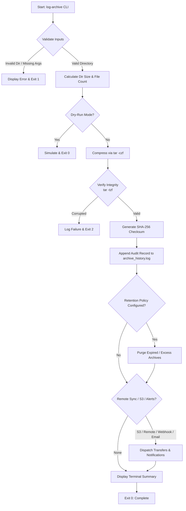

# Log Archive Tool (`log-archive`)

A production-ready, zero-dependency Bash command-line utility that archives and compresses system or application logs into timestamped `tar.gz` archives, maintains a structured audit history log, verifies data integrity, and automates log retention and offsite backup replication.

Inspired by the [roadmap.sh DevOps Project: Log Archive Tool](https://roadmap.sh/projects/log-archive-tool).

---

## Key Features

### 1. Core Functionality (Project Requirements)
- **Flexible CLI Argument**: Pass any target log directory as an argument (`log-archive <log-directory>`).
- **Standardized Compression**: Packages logs into gzip-compressed tar archives named in the exact required format:
  ```text
  logs_archive_YYYYMMDD_HHMMSS.tar.gz
  ```
- **Audit & History Logging**: Automatically appends execution timestamp, source directory, archive file name, uncompressed/compressed sizes, file count, and status to a history log file (`archive_history.log`).
- **Configurable Destination**: Save archives to a custom directory via positional argument or `-o / --output-dir` (defaults to `./archived_logs`).

### 2. DevOps & Production Capabilities (Stretch Goals)
- **Integrity Verification**: Verifies the archive immediately after creation using `tar -tzf` and generates an accompanying SHA-256 checksum file (`.sha256`).
- **Automated Retention & Rotation**:
  - `--retention <days>`: Purge archives older than $N$ days to prevent disk exhaustion.
  - `--keep <N>`: Retain only the latest $N$ archives, automatically removing older copies.
- **Selective File Exclusion**: Pass `--exclude <pattern>` (or `-e`) to ignore active socket files, locks, or temp caches (e.g. `-e "*.sock" -e "*.tmp"`).
- **Offsite Remote Backup Sync**: Sync archives to a remote host via `rsync` or `scp` (`-s user@backup-server:/path`).
- **Cloud Storage Upload**: Direct integration with AWS S3 (`-c s3://bucket/path`).
- **Alert Notifications**:
  - Webhooks (`-w <url>`): Send JSON event payloads directly to Slack, Discord, or monitoring APIs.
  - Email (`-m <address>`): Send completion summary via standard mail transfer agents.
- **Safety & Dry-Run Mode**: Test configurations without writing or deleting any files using `-n / --dry-run`.
- **Recursion Protection**: Intelligently prevents archiving output destination directories located inside the target log tree.
- **POSIX & Cross-Platform**: Zero external runtime dependencies; fully compatible with macOS (BSD tools) and Linux distributions (Ubuntu, Debian, RHEL, CentOS, Alpine, Arch).

---

## Architecture & Workflow



---

## Zero Dependencies

`log-archive` relies strictly on core POSIX shell utilities already present on any Unix-like system:
- `bash` (v3.2+)
- `tar` (GNU tar & BSD tar compatible)
- `gzip`
- `awk`, `find`, `stat`, `date`, `du`
- `sha256sum` / `shasum`

No package managers, Python runtimes, or compilation steps required.

---

## Installation & Setup

### Option 1: Quick Install to System PATH (Recommended)

```bash
# Clone the repository
git clone git@github.com:Davidbassemm/devops-projects.git
cd devops-projects/log-archive

# Make executable and symlink into /usr/local/bin
chmod +x log-archive.sh
sudo cp log-archive.sh /usr/local/bin/log-archive

# Verify installation
log-archive --version
```

### Option 2: Run Locally from Project Folder

```bash
cd devops-projects/log-archive
chmod +x log-archive.sh

# Run via script or local symlink
./log-archive --help
```

---

## CLI Usage & Options

```text
log-archive v1.0.0 - CLI Log Archiving & Compression Tool

USAGE:
  log-archive <log-directory> [output-directory] [OPTIONS]

ARGUMENTS:
  <log-directory>             Path to the directory containing logs to archive
  [output-directory]          Optional destination directory (default: ./archived_logs)

OPTIONS:
  -o, --output-dir <dir>      Destination directory to store compressed archives
  -l, --log-file <file>       Path to archive history log file (default: <output-dir>/archive_history.log)
  -r, --retention <days>      Purge archives older than <days> days
  -k, --keep <N>              Keep only the latest <N> archives, purging older ones
  -e, --exclude <pattern>     Exclude files/folders matching glob pattern (can repeat)
  -s, --remote <dest>         Sync archive to remote host via rsync/scp (e.g. user@host:/path)
  -c, --s3 <s3-uri>           Upload archive to AWS S3 bucket (e.g. s3://my-bucket/logs/)
  -m, --email <address>       Send completion notification email
  -w, --webhook <url>         Send completion JSON webhook payload (Slack/Discord/Custom API)
  -n, --dry-run               Simulate archiving without modifying files
      --no-checksum           Skip generating SHA-256 verification checksum
  -H, --history [N]           Display the last N entries of the archive history log (default: 10)
      --schedule              Print cron and systemd timer configuration examples
  -v, --verbose               Enable verbose output during archiving
  -q, --quiet                 Run silently without terminal output (ideal for cron jobs)
      --no-color              Disable ANSI colored output
  -h, --help                  Display this help menu and exit
  -V, --version               Display version information and exit
```

---

## Practical Examples

### 1. Basic Archiving
Archive the standard Linux `/var/log` directory into `./archived_logs`:
```bash
sudo log-archive /var/log
```

### 2. Custom Output Directory
Specify destination directory positionally or with `-o`:
```bash
# Positional destination
sudo log-archive /var/log /backup/system_logs

# Flag destination
sudo log-archive /var/log -o /backup/system_logs
```

### 3. File Exclusions & Retention Policy
Archive Nginx logs, ignore socket files and `.tmp` caches, and keep only the latest 10 archives:
```bash
sudo log-archive /var/log/nginx -o /backup/nginx -e "*.sock" -e "*.tmp" -k 10
```

### 4. Cloud Backup (AWS S3) & Webhook Alert
Archive application logs, upload directly to an S3 bucket, and trigger a Slack notification:
```bash
log-archive /var/log/myapp \
  -o /backup/myapp \
  -c s3://my-cloud-backup-bucket/production/logs/ \
  -w "https://hooks.slack.com/services/T00/B00/XXXX"
```

### 5. Inspect Archive History
Review recent archiving operations recorded in the log file:
```bash
log-archive --history 5
```

---

## Sample Console Output

```text
======================================================================
                 LOG ARCHIVE & COMPRESSION TOOL                       
======================================================================
 Timestamp          : 2026-09-30 17:38:32 EEST
 Source Directory   : /var/log
 Files to Archive   : 48 files (38.45 MB)
 Destination Dir    : /backup/system_logs
 Target Archive     : logs_archive_20260930_173832.tar.gz
----------------------------------------------------------------------

[+] Compressing logs into logs_archive_20260930_173832.tar.gz...
[+] Verifying archive integrity...
[✓] Archive integrity verified.
[✓] Archive event recorded in history log: /backup/system_logs/archive_history.log

======================================================================
                 ARCHIVE COMPLETED SUCCESSFULLY                       
======================================================================
 Archive File       : /backup/system_logs/logs_archive_20260930_173832.tar.gz
 Original Size      : 38.45 MB (48 files)
 Compressed Size    : 5.12 MB
 Space Saved        : 86.7%
 SHA-256 Checksum   : 097a5233ee7008e3db46b507209bbf7fb2d82fa238a0d69ffb25f3224abe8994
 Elapsed Time       : 2 second(s)
 History Log Entry  : /backup/system_logs/archive_history.log
======================================================================
```

---

## Audit History Log Format

Every execution writes a structured, timestamped line to `archive_history.log`:

```text
[2026-09-30 17:38:32] SUCCESS | Archive: logs_archive_20260930_173832.tar.gz | Source: /var/log | Original: 38.45 MB (48 files) | Compressed: 5.12 MB (86.7% saved) | Duration: 2s | SHA256: 097a5233ee7008e3db46b507209bbf7fb2d82fa238a0d69ffb25f3224abe8994
[2026-09-30 17:40:19] PURGE | Removed excess archive: logs_archive_20260920_020000.tar.gz (Keep quota: 10)
```

---

## Automated Scheduling

### Crontab Setup

Run `log-archive --schedule` or edit crontab via `crontab -e`:

```cron
# Daily archive at 02:00 AM with 30-day retention running silently
0 2 * * * /usr/local/bin/log-archive /var/log -o /var/log/archives -r 30 -q >> /var/log/archives/cron.log 2>&1

# Hourly web server logs archiving keeping latest 48 files
0 * * * * /usr/local/bin/log-archive /var/log/nginx -o /var/log/archives/nginx -k 48 -q >> /var/log/archives/nginx/cron.log 2>&1
```

*(See [`examples/cron-schedule.tab`](./examples/cron-schedule.tab) for more configurations).*

### Systemd Timer Setup (Linux)

Production systemd unit templates are provided in the [`examples/`](./examples/) folder:

1. Copy service and timer units:
   ```bash
   sudo cp examples/log-archive.service /etc/systemd/system/
   sudo cp examples/log-archive.timer /etc/systemd/system/
   ```

2. Reload and enable timer:
   ```bash
   sudo systemctl daemon-reload
   sudo systemctl enable --now log-archive.timer
   systemctl list-timers --all | grep log-archive
   ```

---

## Testing & Quality Assurance

A comprehensive automated test suite is included in `test_log_archive.sh`. It validates **41 unit, integration, and adversarial assertions** (100% pass rate) after undergoing independent DevOps QA and Security audit sign-off:

```bash
./test_log_archive.sh
```

### Test Coverage Highlights
- Argument validation (missing parameters, non-existent directories, invalid flags, `--` delimiter)
- Source == Destination edge case (preserves source files when archiving into itself)
- Sibling directory prefix collision protection
- Filenames and directory paths containing spaces and special characters
- Unsearchable source directory handling (`chmod 444`) and read-only destination protection (`chmod 555`)
- Archive compression and relative structure verification
- SHA-256 checksum calculation & match verification
- File pattern exclusions (`--exclude`)
- Retention policies (`--retention` and `--keep` quotas, rejecting non-positive integers)
- Dry-run simulation mode (`--dry-run`)
- Silent execution (`--quiet`) for cron jobs
- History log recording and history reader (`--history`)

---

## Project Structure

```text
log-archive/
├── README.md                 # Complete documentation
├── log-archive.sh            # Main executable CLI script
├── log-archive               # Convenience symlink to log-archive.sh
├── test_log_archive.sh       # 41-assertion automated test suite
└── examples/
    ├── cron-schedule.tab     # Production crontab examples
    ├── log-archive.service   # Systemd service unit template
    └── log-archive.timer     # Systemd timer unit template
```

---

## Author & Contact

- **Author**: David Bassem
- **GitHub**: [@Davidbassemm](https://github.com/Davidbassemm)
- **Email**: davidbassem694@gmail.com

---

## License

This project is licensed under the MIT License - see the [LICENSE](../LICENSE) file for details.
